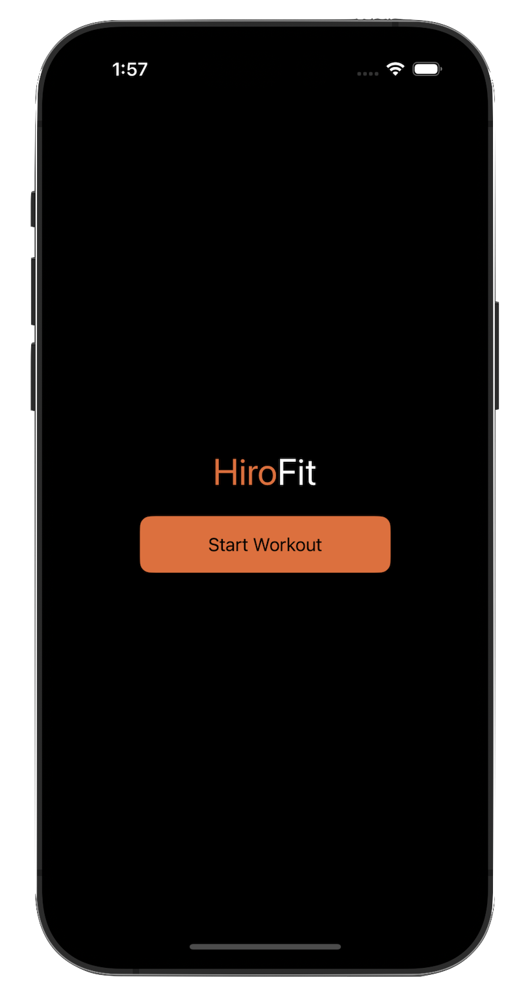
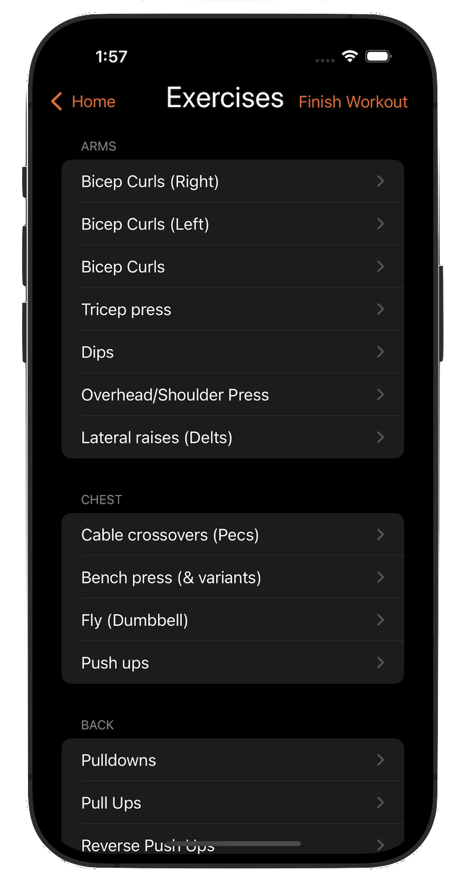
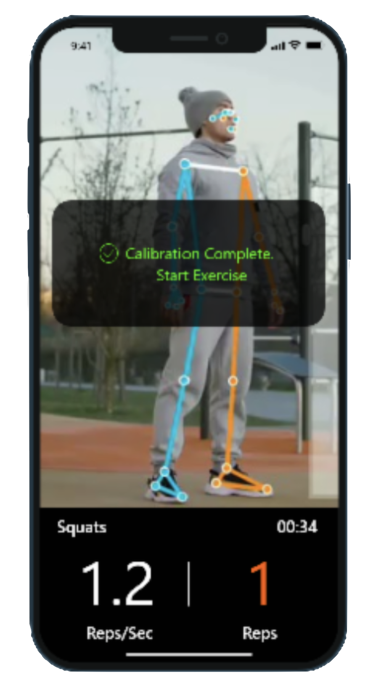
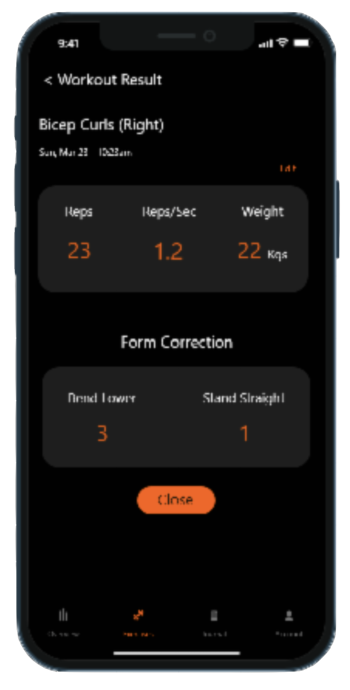

# HiroFit

HiroFit is an innovative iOS fitness application that leverages computer vision and machine learning to provide real-time workout tracking and feedback. The app helps users perfect their form and maximize their workout effectiveness through intelligent motion tracking and personalized coaching.

## Media

<div style="display: flex; justify-content: center; flex-wrap: nowrap;">
  
  
  
  
</div>

## Features

### 🏋️ Comprehensive Exercise Library
- Wide range of exercises covering multiple muscle groups:
  - Arms (Biceps, Triceps, Shoulders)
  - Chest
  - Back
  - Legs
  - Core/Abs
  - Compound movements

### 📱 Intelligent Workout Tracking
- Real-time motion tracking using computer vision
- Form correction and feedback
- Rep counting and timing
- Weight and set tracking

### 💪 Personalized Experience
- Custom workout creation
- Progress tracking
- Performance metrics
- Workout summaries and history

### 🎨 Modern UI/UX
- Clean, intuitive interface
- Real-time visual feedback
- Dark mode support
- Custom branded color scheme

## Technical Stack

- **Frontend**: SwiftUI
- **Computer Vision**: CoreML
- **Architecture**: MVVM
- **iOS Target**: iOS 15+

## Installation

1. Clone the repository
```bash
git clone https://github.com/PaulKratsios18/HiroFit.git
```

2. Open the project in Xcode
```bash
cd HiroFit
open HiroFit.xcodeproj
```

3. Build and run the application


## Acknowledgments

- Designed and developed by Wyatt Makedonski, Lavin Hira, Paul Kratsios
